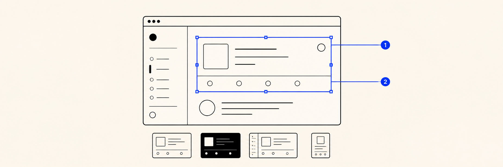

# GuideShot

GuideShot turns strict, declarative recipes into reproducible screenshots of real application states. One recipe can cover locales, themes, roles, and viewports while annotations stay attached to stable DOM targets instead of coordinates.

Phase 1 is a TypeScript vertical slice: schema and planning, isolated Chromium capture, offline annotation composition, an explicit CLI workflow, and a deterministic React pilot application. GuideShot is MIT licensed and targets macOS and Linux.

## How it is structured

```text
@guideshot/schema  ←  @guideshot/core  ←  @guideshot/playwright
                                  └────←  @guideshot/renderer
             schema + core + driver + renderer  ←  @guideshot/cli

apps/site  React, Tailwind, and shadcn pilot; not a package dependency
```

| Workspace               | Responsibility                                                                                                      |
| ----------------------- | ------------------------------------------------------------------------------------------------------------------- |
| `@guideshot/schema`     | Versioned recipe and public-manifest JSON Schemas plus inferred TypeScript types                                    |
| `@guideshot/core`       | Parsing, validation, matrix planning, interpolation, cache identities, diagnostics, manifests, and shared contracts |
| `@guideshot/playwright` | Chromium lifecycle, isolated contexts, stable target resolution, actions, readiness, framing, and clean capture     |
| `@guideshot/renderer`   | Network-disabled composition of callouts, arrows, spotlights, and outlines from sanitized scenes                    |
| `@guideshot/cli`        | Configuration, server lifecycle, cache and artifact orchestration, command output, and publication                  |
| `@guideshot/site`       | Homepage, documentation, and deterministic capture fixture                                                          |

The dependency boundary is intentional. Core does not import Playwright, Vite, React, or application code. Recipes remain portable data; trusted TypeScript adapters own authentication and application-specific state.

## Requirements

- Node.js 20.5 or newer for the complete package family
- Node.js 22.13 or newer to run the complete workspace and pilot site
- pnpm 10
- Playwright Chromium

The workspace pins Node.js 22.18 for project scripts. With pnpm 10.14 or newer,
`pnpm install` downloads that runtime automatically when the active shell is
using an older Node.js release. `.nvmrc` provides the same version for users who
prefer a version manager.

Set up a checkout:

```sh
pnpm install
pnpm --filter @guideshot/playwright exec playwright install chromium
pnpm build
pnpm test
```

On Linux CI, Playwright may require `pnpm --filter @guideshot/playwright exec playwright install --with-deps chromium`.

## Configuration

Project configuration is trusted TypeScript. Recipes never contain credentials, arbitrary JavaScript, database access, or environment secrets.

```ts
// guideshot.config.ts
import { defineConfig, defineDimension, defineScenario } from '@guideshot/core';
import { playwrightDriver } from '@guideshot/playwright';
import { htmlRenderer } from '@guideshot/renderer';

const locale = defineDimension({
  name: 'locale',
  version: '1',
  values: ['en', 'da', 'nb'],
  resolve: (value: 'en' | 'da' | 'nb') => ({ locale: value }),
});

const theme = defineDimension({
  name: 'theme',
  version: '1',
  values: ['light', 'dark'],
  resolve: (value: 'light' | 'dark') => ({ colorScheme: value }),
});

const authenticatedPilot = defineScenario({
  name: 'pilot:authenticated',
  version: '1',
  schema: { type: 'object', additionalProperties: false },
  prepare: ({ baseUrl, variants }) => ({
    variables: { exampleName: 'Invite a teammate' },
    browser: {
      localStorage: [
        {
          origin: baseUrl.origin,
          values: {
            'guideshot:demo-session': JSON.stringify({
              version: 1,
              userId: 'demo-admin',
            }),
            'guideshot:locale': String(variants.locale),
            'guideshot:theme': String(variants.theme),
          },
        },
      ],
    },
  }),
});

export default defineConfig({
  recipes: ['shots/**/*.shot.json'],
  outputDir: 'generated/guideshot',
  cacheDir: '.guideshot/cache',
  capture: { concurrency: 4 },
  server: {
    command: 'pnpm --filter @guideshot/site dev',
    url: 'http://localhost:3000',
  },
  safety: { allowedOrigins: ['http://localhost:3000'] },
  targetAttribute: 'data-guide-target',
  profiles: {
    'guide.desktop': {
      viewport: { width: 1280, height: 960 },
      pixelRatio: 2,
      timezoneId: 'UTC',
      reducedMotion: 'reduce',
    },
  },
  dimensions: { locale, theme },
  scenarios: { 'pilot:authenticated': authenticatedPilot },
  driver: playwrightDriver(),
  renderer: htmlRenderer(),
});
```

## Recipes and matrices

JSON is canonical; `.jsonc` is accepted for authoring. Unknown properties are rejected. The matrix shape is deliberately explicit: dimensions belong under `matrix.dimensions`, while includes and excludes are selections.

```json
{
  "version": 1,
  "id": "pilot.recipes.create",
  "profile": "guide.desktop",
  "scenario": { "use": "pilot:authenticated" },
  "page": { "path": "/demo/recipes" },
  "matrix": {
    "dimensions": {
      "locale": ["en", "da", "nb"],
      "theme": ["light", "dark"]
    },
    "exclude": [{ "locale": "nb" }],
    "include": [{ "locale": "nb", "theme": "dark" }]
  },
  "prepare": [
    { "do": "click", "target": "recipes.create" },
    {
      "do": "fill",
      "target": "recipe.name",
      "value": "${scenario.exampleName}"
    }
  ],
  "ready": [
    { "expect": "visible", "target": "recipe.form" },
    { "expect": "hidden", "target": "app.loading" }
  ],
  "capture": {
    "frame": {
      "around": ["recipe.form"],
      "padding": 40,
      "aspectRatio": "4:3",
      "fit": "expand"
    }
  },
  "annotations": [
    {
      "id": "recipe-name",
      "kind": "callout",
      "target": "recipe.name",
      "content": "Give the recipe a stable name.",
      "connector": { "kind": "arrow" },
      "emphasis": { "kind": "spotlight", "padding": 6 }
    }
  ],
  "accessibility": {
    "alt": "The new recipe form with its name field highlighted."
  },
  "output": { "formats": ["webp"], "quality": 92 }
}
```

Dimension names are ordered deterministically and declared value order is preserved. Duplicate values, output-key collisions, unknown dimensions, incomplete `include` rows, and unsupported values fail before a browser starts. References are restricted to `${scenario.name}` and `${variant.name}` data lookups; they are not expressions.

Phase 1 publishes one canonical `png` or `webp` asset per variant. Additional
source formats are intentionally deferred until the manifest can model them
without ambiguous duplicate variant keys.

Application targets use stable identity:

```tsx
<Button data-guide-target="recipes.create">New recipe</Button>
```

Every action, annotation, and framed target must resolve unambiguously. Missing, duplicated, hidden, or unstable targets produce stable diagnostic codes.

## CLI workflow

Capture is always explicit:

```sh
pnpm exec guideshot validate
pnpm exec guideshot schema
pnpm exec guideshot plan
pnpm exec guideshot capture
pnpm exec guideshot capture --concurrency 8
pnpm exec guideshot compose
pnpm exec guideshot verify
```

- `validate` loads the config and validates recipes, adapter references, and output identities without opening Chromium.
- `schema` writes the portable recipe and public-manifest schemas for editor and tooling integration.
- `plan` prints the expanded jobs and deterministic cache keys without preparing scenarios.
- `capture` starts or attaches to the configured server, runs the configured number of jobs concurrently in isolated browser contexts, composes assets, and publishes the manifest in deterministic order. `--concurrency` overrides the project setting for one run.
- `compose` renders from valid cached scenes without reopening the application.
- `verify` checks the public manifest and its referenced assets.

Capture and composition use separate identities. Changing page state, actions, framing, dimensions, or adapter versions invalidates capture. Changing only annotation copy, presentation, alt text, or output settings reuses the scene and recomposes.
After publishing the new manifest, capture and composition remove assets that were referenced only by the previous manifest while preserving outputs retained by scoped runs.
Scenarios that mutate shared fixture state can declare the same `concurrencyKey`; GuideShot will serialize those jobs while continuing to run independent jobs in parallel.

## Pilot application

After the initial `pnpm install`, run the site from the repository root with
`pnpm dev`, then open:

- `/` — project homepage
- `/docs` — Phase 1 documentation
- `/demo` — pilot router
- `/demo/sign-in` — deterministic, unauthenticated fixture
- `/demo/recipes` — fixture-authenticated recipe workspace

The sign-in fixture accepts `demo@guideshot.dev` and stores only a synthetic local session. The recipes route supports English, Danish, and Norwegian Bokmål, light and dark themes, and stable `data-guide-target` markers. It also includes a synthetic privacy target; pixel-level masking is covered by the controlled driver fixture without live customer data.

The two pilot recipes publish twelve committed assets at
`apps/site/public/generated/guideshot`; the homepage consumes that public
manifest directly as its dogfooding showcase. Inside the pilot, the bright Help
button opens those same compiled screenshots as a guide and selects the exact
English, Danish, or Norwegian Bokmål light/dark variant currently in use.

The pilot is application code, not `@guideshot/react`, and its Next.js runtime is independent of the future `@guideshot/vite` adapter.

Public packages are versioned with Changesets and published through the GitHub Actions release workflow with npm trusted publishing. The documentation site is a standalone Next.js application deployed at [guideshot.dev.wemuda.com](https://guideshot.dev.wemuda.com/), which also serves the canonical versioned JSON Schemas.

## Security and privacy boundary

- Only HTTP and HTTPS are supported. Loopback origins work by default; every non-loopback origin must be explicitly allowlisted.
- Credentials in server or page URLs are rejected, and recipe page paths cannot navigate outside the configured origin.
- Output and cache paths must be distinct descendants of the project root; artifact traversal is rejected.
- Browser cookies, local storage, headers, scenario inputs, absolute paths, and private provenance are not fields in the public manifest.
- Elements marked with a `privacy.` target prefix are masked inside Chromium before screenshot bytes leave the driver.
- Persisted scenes carry an explicit `sanitized: true` contract. The offline renderer refuses any scene that is not marked sanitized, checks the background hash, blocks network access, and escapes annotation content.
- Phase 1 fixtures use synthetic data. Do not point recipes at production accounts or place secrets in recipes, logs, annotation text, or scenario `safeVariables`.

Automatic sensitive-data classification, configurable redaction policies, and private trace retention are later hardening work; they are not implied by the Phase 1 contract.

## Development

```sh
pnpm dev             # pilot site
pnpm build
pnpm lint
pnpm typecheck
pnpm test
pnpm format:check
```

Package-level work can use `pnpm --filter @guideshot/core test` or the corresponding workspace name. See [CONTRIBUTING.md](CONTRIBUTING.md) for boundaries and review expectations.

## Deliberate deferrals

Phase 2 and later will address the Vite virtual manifest and HMR adapter, optional React consumer, authoring inspector and comparison gallery, compound project schemas, source-set staleness, changed-file planning, registered custom actions, advanced privacy policies, traces and richer reports, artifact stores, migrations, pinned CI images, and additional browser drivers. Package publication and standalone site deployment are already implemented.

Ordinary frontend builds will consume previously generated assets. They will not implicitly launch a browser, authenticate, seed data, or capture screenshots.

## License

[MIT](LICENSE) © GuideShot contributors.
